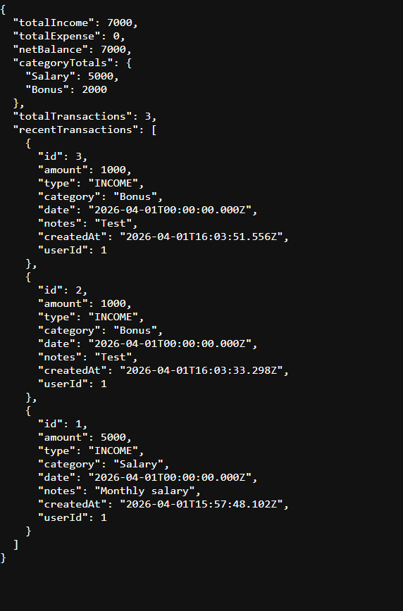
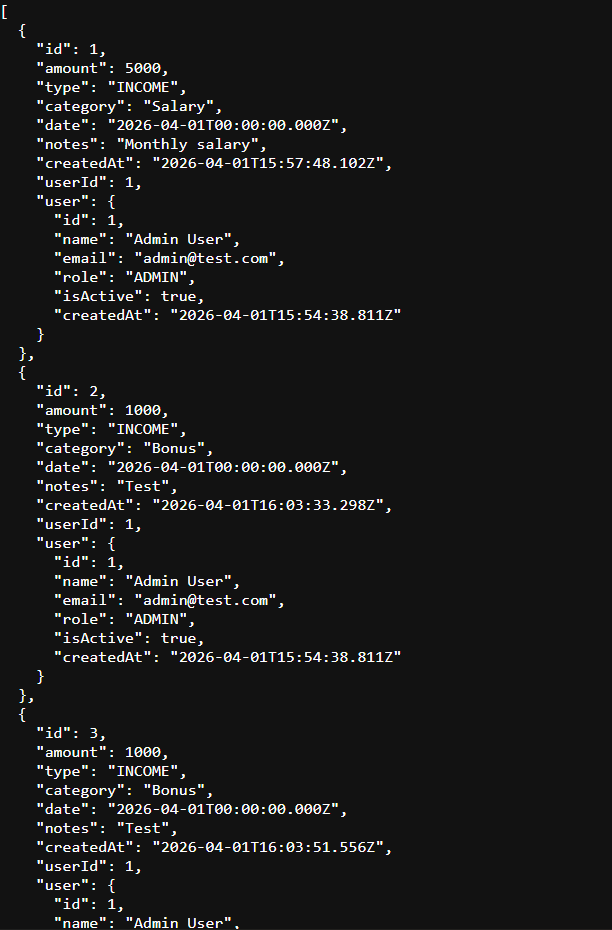

# Finance Backend API

## Overview
This project is a backend system for a finance dashboard that supports user management, financial records, role-based access control, and summary analytics.

The goal of this project is to demonstrate backend architecture, API design, data handling, and access control.

---

## Tech Stack
- Node.js
- Express.js
- Prisma ORM
- SQLite

---

## Features

### User Management
- Create and manage users
- Assign roles (ADMIN, ANALYST, VIEWER)
- Manage user active status

### Financial Records
- Create and view financial records
- Fields:
  - Amount
  - Type (INCOME / EXPENSE)
  - Category
  - Date
  - Notes
- Each record is linked to a user

### Role-Based Access Control
- ADMIN: Full access (create and view)
- ANALYST: Read-only access
- VIEWER: Restricted access

### Dashboard Summary
- Total income
- Total expenses
- Net balance
- Category-wise totals
- Total transactions
- Recent transactions

### Filtering Support
- Filter records by:
  - Type
  - Category
  - Date range

### Validation
- Prevents invalid input (e.g., negative amount, invalid date)
- Returns meaningful error messages

---

## API Endpoints

### Users
- POST /users → Create user
- GET /users → Get all users

### Records
- POST /records → Create record (ADMIN only)
- GET /records → Get records (ADMIN, ANALYST)
  - Supports query parameters:
    - ?type=INCOME
    - ?category=Salary
    - ?startDate=YYYY-MM-DD&endDate=YYYY-MM-DD

### Summary
- GET /summary → Dashboard data (ADMIN, ANALYST)

---

## Access Control
Role-based access control is implemented using custom middleware to restrict actions based on user roles.

---

## API Documentation

Postman collection is available here:

[Download Postman Collection](./postman_collection.json)

---

## How to Run

1. Install dependencies:npm install

2. Run the server:node src/server.js

3. Server runs on: http://localhost:3000/

---

## Screenshots

### Summary API

### Records API

---

## Design Decisions
- Middleware is used to separate access control logic from route logic
- Prisma ORM is used for clean and scalable database interaction
- SQLite is used for simplicity and quick setup
- Code is organized into routes, middleware, and utilities for maintainability

---

## Future Improvements
- Add authentication (JWT)
- Add pagination for records
- Improve filtering and search
- Add unit and integration tests
- Deploy the application

---

## Key Learnings
- Backend architecture and API design
- Role-based access control implementation
- Data validation and error handling
- Building maintainable and scalable backend systems